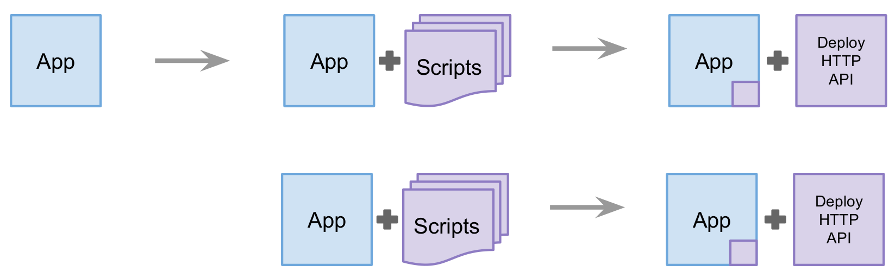
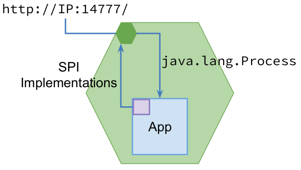
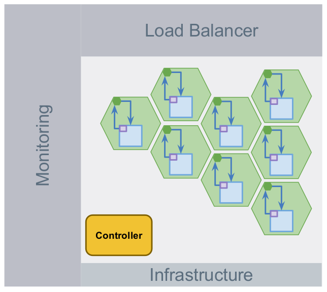

## Massive Deployments on Amazon AWS with JVM

Behrooz Nobakht

[\@behruz](https://twitter.com/behruz)

## Timeline

## From *On-Premise* to *Managed*

## What does *massive* mean?

## What is a *server*?

### Development

* Um, huh?!
* ... *pause* ...
* We shipt it to Ops.
* They deploy!

### Operation

* *What* version to install?
* *What* process to start?
* *Which* data to use?
* *How* to access logs?
* *How* to monitor processes?
* *How* to sync our infra; e.g. LB servers?

## *Server* abstraction is too *low-level* for our *development* and *operation*

## Server as an HTTP API

1. `/install`
2. `/create`
3. `/process`
4. `/logs`
5. `/monitor`
6. `/resources`

## A JVM for a JVM
**Service Provider Interfaces (SPI)**

* A few "factory" patterns
* Generic RESTful operations: logs, monitors, resources

## *Deployment* is a development responsibility

* Does it have `//:14777/`?
* SPI implemented?
* Tested and Integrated?
* Locally Deployable?
* Deliver to Ops.
* They Deploy!

## Does it really matter what's beneath `//:14777/` ?!

##

## 

* Infrastructure provides servers
* Every server boots with one `//:14777/`
* Auto-register server with Controller
* Controller synchronizes servers with load balancers
* Controller manages the *state* of servers
* Controller automates *workflows*

## How we benefit?

* Orchestration becomes automatic
* Relieve from *small* operation *details*
* Disaster Recovery
* Failure Mitigation
* Monitoring
* Horizontal Scaling

##

Operating
≅ 2000 AWS servers
with an
awesome small
DevOps team

## 

<http://labs.sdl.com/>
